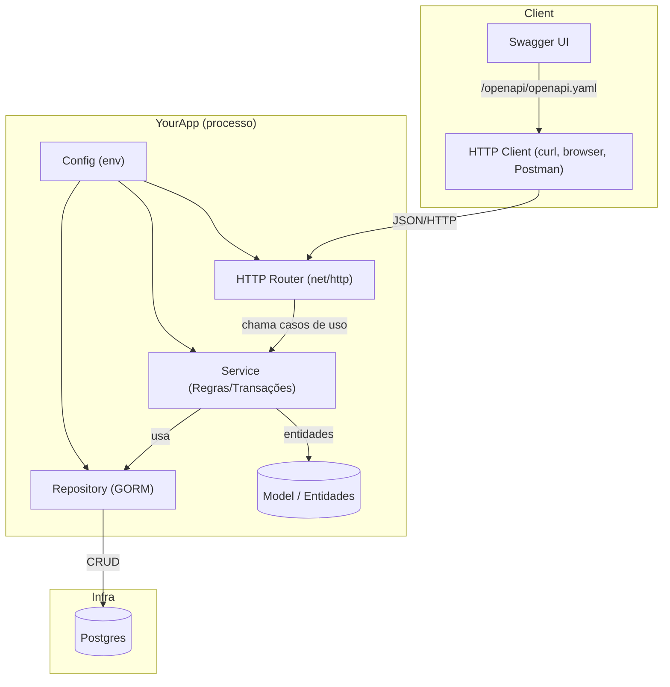

# Construção de Software 2025/02
Grupo L

https://github.com/v-Kaefer/Const-Software-25-02


# Sprint 0 - Update



---


# Sprint 0 – Setup de Time, Stack e Projeto

Este pacote entrega um **arquivo fonte OpenAPI** para o domínio `User` (com **POST**, **PATCH** e **PUT**), um **README** passo‑a‑passo, além de arquivos básicos de infraestrutura (Docker/Docker Compose e migração SQL) para iniciar o projeto com Go, Gin e PostgreSQL.

---

## 📦 Estrutura do repositório

```
.
├── cmd/
│   └── api/
│       └── main.go                # (stub futuro) inicialização do servidor Gin
├── internal/
│   ├── config/                    # (stub futuro) leitura de envs/config
│   ├── http/                      # (stub futuro) middlewares e roteamento
│   └── user/                      # (stub futuro) handlers, service e repository
├── migrations/
│   └── 0001_init.sql              # criação da tabela users
├── openapi/
│   └── openapi.yaml               # especificação da API
├── Dockerfile                     # build da API
├── docker-compose.yml             # orquestração (db, api, swagger)
├── .env.example                   # variáveis de ambiente padrão
└── README.md                      # instruções de build/run/test
```

---


# User Service – Go + Gin + PostgreSQL

**Sprint 0 – Setup de Time, Stack e Projeto**

> Serviço base para o domínio **User**, com especificação **OpenAPI**, infraestrutura Docker, migração SQL e CI simples em GitHub Actions.

## Sumário
1. [Objetivo](#objetivo)
2. [Pré-requisitos](#pré-requisitos)
3. [Como rodar com Docker Compose](#como-rodar-com-docker-compose)
4. [Como rodar localmente (sem Docker)](#como-rodar-localmente-sem-docker)
5. [Entregas da Sprint 0 (Definition of Done)](#entregas-da-sprint-0-definition-of-done)
6. [Entregas da Sprint 1 (Definition of Done)](#entregas-da-sprint-1-definition-of-done)


## Objetivo
Preparar o ambiente e a estrutura mínima para iniciar o desenvolvimento do domínio `User` com **CRUD** completo definido em OpenAPI.

## Pré-requisitos
- Docker Desktop/Engine e Docker Compose
- Go 1.22+ (para desenvolvimento local fora do container)
- Terraform (apenas para desenvolvimento e deploy de infra)

## Como rodar com Docker Compose
1. Crie seu `.env` a partir do exemplo:
   ```bash
   cp .env.example .env
    ```
2. Suba **apenas o banco** inicialmente:

   ```bash
   docker compose up -d db
   ```
3. Aplique a migração inicial:

   ```bash
   docker compose exec -T db psql -U app -d app -f /migrations/0001_init.sql
   ```
4. (Opcional nesta sprint) Suba API e Swagger:

   ```bash
   docker compose up -d api swagger
   # API:    http://localhost:8080
   # Swagger http://localhost:8081
   ```
5. Acompanhe logs (útil quando a API estiver implementada):

   ```bash
   docker compose logs -f api
   ```

## Como rodar localmente (sem Docker)

> Útil quando o servidor Gin for implementado.

1. Garanta um PostgreSQL local acessível.
2. Configure `DATABASE_URL` (ver [Variáveis de ambiente](./CONTRIBUTING.md)).
3. Aplique a migração:

   ```bash
   psql "$DATABASE_URL" -f migrations/0001_init.sql
   ```
4. Rode a aplicação:

   ```bash
   go run ./cmd/api
   ```


# Entregas da Sprint 0 (Definition of Done)

* **Stack definida** (Go, Gin, PostgreSQL)
* **Repositório Git com estrutura** (diretórios e arquivos guia)
* **Docker + docker-compose com banco rodando** (serviço `db`, `api` e `swagger` prontos)
* **CRUD para User (definição OpenAPI)** com **POST**, **PATCH** e **PUT** detalhados (GET/DELETE incluídos)
* **README** com instruções de build/run/test

# Entregas da Sprint 1 (Definition of Done)

**Infraestrutura do projeto definida e gerenciada na AWS:**
* Scripts e configurações IaC.
* Todos os artefatos necessários para a configuração da infraestrutura na AWS.
* Projeto no GitHub contendo a pasta (infra)
* 
Entrega Final:
O trabalho deve ser entregue em um arquivo .zip contendo o repositório de fontes completo, incluindo a pasta

